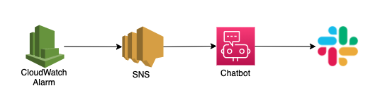

# 目的

Lambdaのエラーを検知してslackに通知してくれるchatbotの覚書き

# ハイレベルアーキテクチャ

# 事前準備

[これ](https://dev.classmethod.jp/articles/aws-chatbot-slack-notification-cdk/)を参考に
  - chatbot workspace configurationをConsoleから作成しておく
  - slackから通知をしたいチャンネルにAWS Chatbot Agentをinviteしておく
